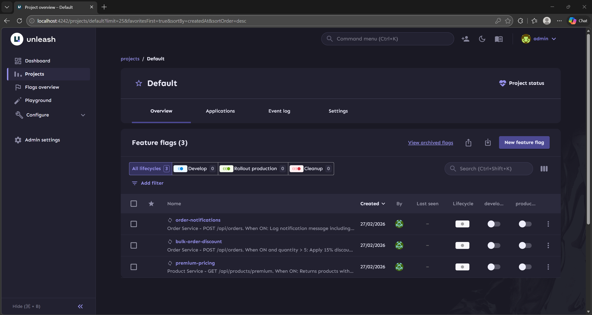
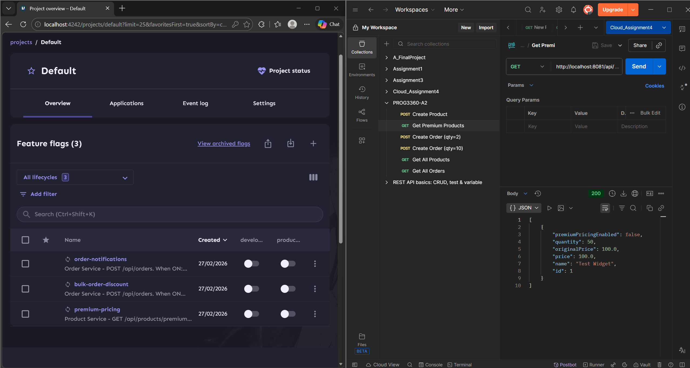
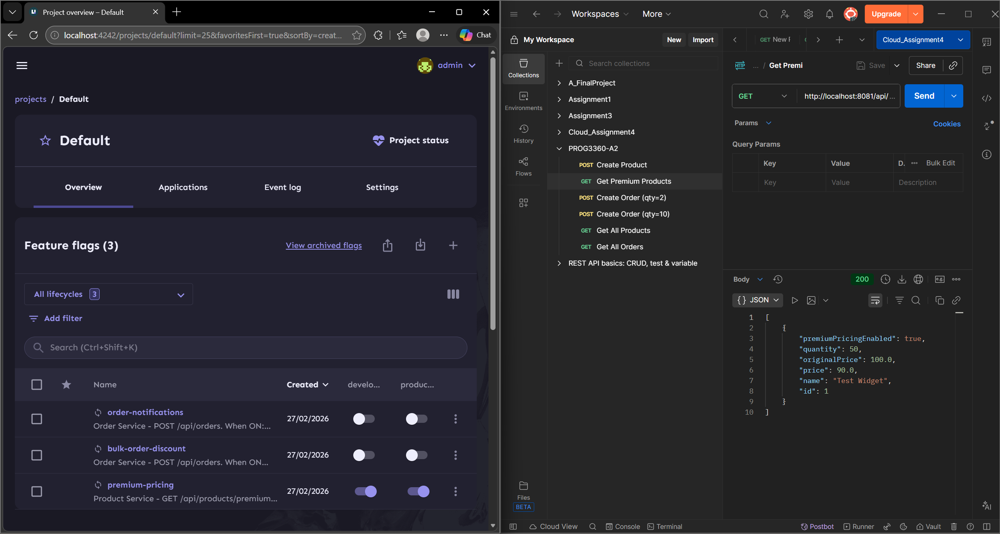
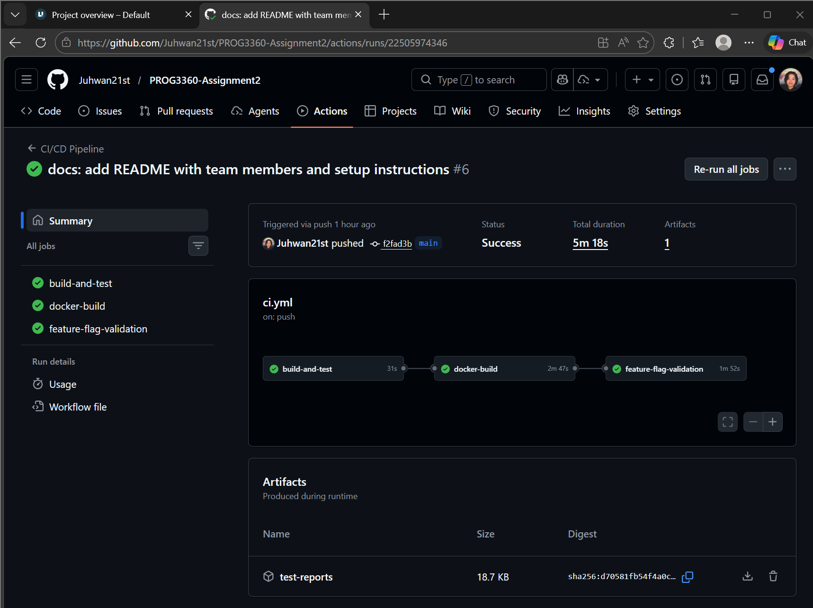
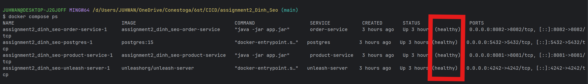
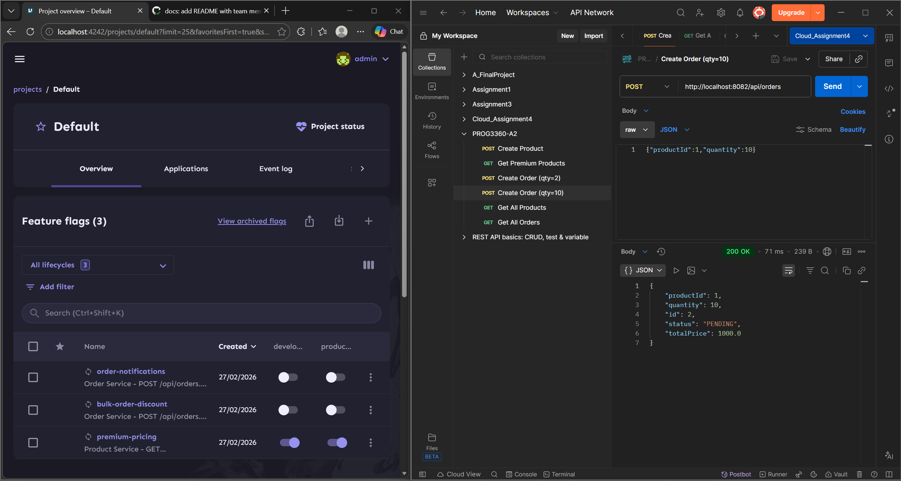
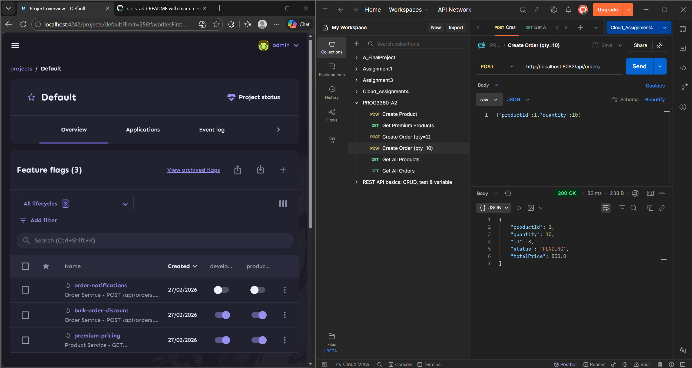

# PROG3360 Assignment 2: Feature Flag Development with Unleash

## Team Members

- Nathan Dinh
- Juhwan Seo

## Project Setup

1. Start all services:

```
docker compose up -d --build --wait
```

2. Initialize feature flags in Unleash:

```
bash scripts/init-flags.sh
```

3. Verify services are running:

```
curl http://localhost:8081/api/products
curl http://localhost:8082/api/orders
curl http://localhost:4242/health
```

## Screenshots

### 1. Unleash Dashboard (all three feature flags)



### 2. Feature Flag Toggle Affecting Application Behavior

**Flag OFF — price: 100.0 (no discount)**



**Flag ON — price: 90.0 (10% discount applied)**



### 3. Successful GitHub Actions Workflow Run



### 4. All Services Running via docker-compose up



### 5. API Calls Demonstrating Feature Flag Behavior (ON vs OFF)

**bulk-order-discount OFF — totalPrice: 1000.0**



**bulk-order-discount ON — totalPrice: 850.0 (15% discount applied)**



---

## Links

- GitHub Repo: https://github.com/Juhwan21st/PROG3360-Assignment2
