# PROG3360 Assignment 4: Observability Logs, Metrics, and Traces

## Team Members

- Nathan Dinh (8765518)
- Juhwan Seo (8819123)

## Project Overview

- Instrument two Spring Boot microservices running in Minikube with full observability
- Learn how logs, metrics, and traces work together to monitor and debug a live system

---

## Part 1 – Logging
- Add structured logging to both services using SLF4J
- Learn how to use log levels (INFO, WARN, ERROR) appropriately in real business logic
- Build a correlation ID system so a single request can be tracked across both services in the logs

---

## Part 2 – Metrics
- Expose a Prometheus metrics endpoint on both services via Spring Boot Actuator
- Deploy Prometheus into Kubernetes and configure it to scrape both services
- Build a live Grafana dashboard to visualize JVM health, HTTP traffic, and custom business data
- Create a custom metric (e.g. order counter or inventory gauge) tied to real application behavior
- Configure an alert rule that fires when a meaningful threshold is crossed

---

## Part 3 – Distributed Tracing
- Deploy Zipkin into the cluster and connect both services to it
- Learn how a single request generates a trace with spans across service boundaries
- Add a custom span around a meaningful operation to measure its duration
- Connect tracing to logging so trace IDs appear directly in log output

---

# Screenshot

## Part 1 - Application Logging

Log output from both services showing INFO, WARN, and ERROR log levels with meaningful data values. The startup logs demonstrate structured logging via SLF4J with database initialization and service readiness messages.

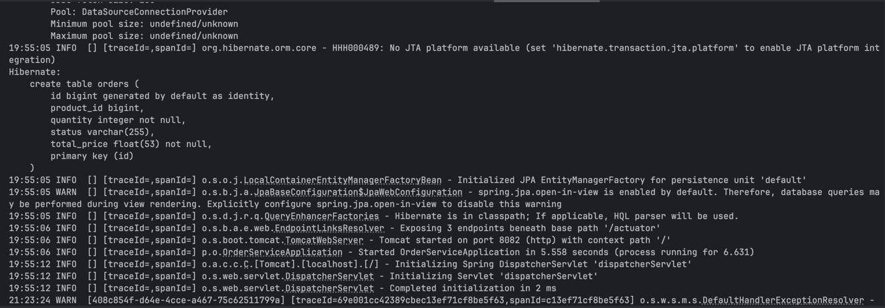

ERROR-level log showing a failed product validation request (404) with traceId and spanId for cross-service debugging.

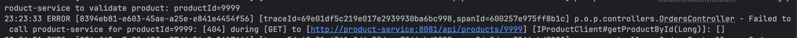

Successful order creation log lines showing the correlationId propagated across both services for a single request, along with meaningful business data (productId, quantity) and Hibernate SQL output.

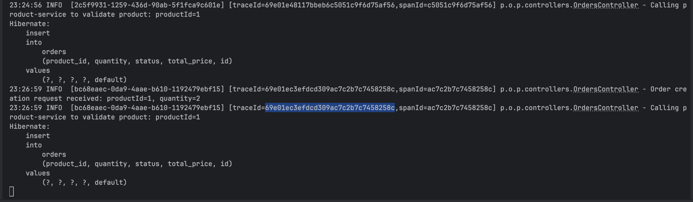

## Part 2 - Metrics with Prometheus and Grafana

The `/actuator/prometheus` endpoint response from the order-service, exposing JVM and custom application metrics including `orders_placed_total`.

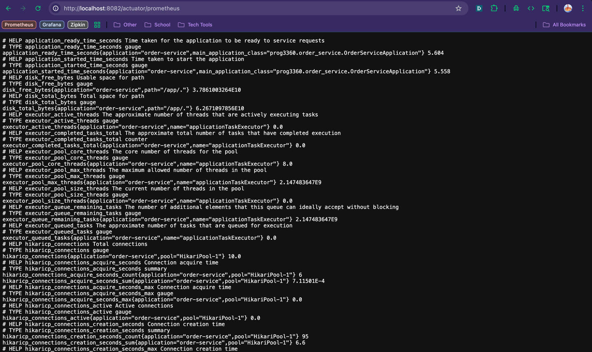

Prometheus Targets page confirming both `order-service` and `product-service` are being scraped successfully with state UP.

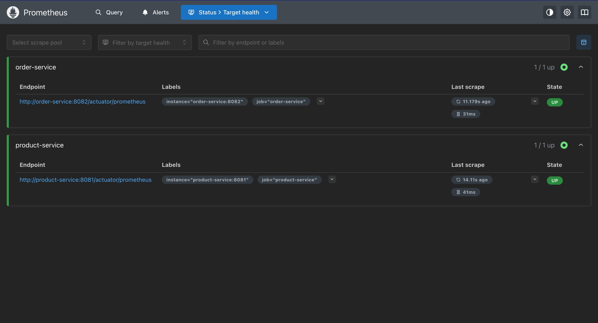

PromQL query in the Prometheus UI returning the custom `orders_placed_total` metric value from the order-service.

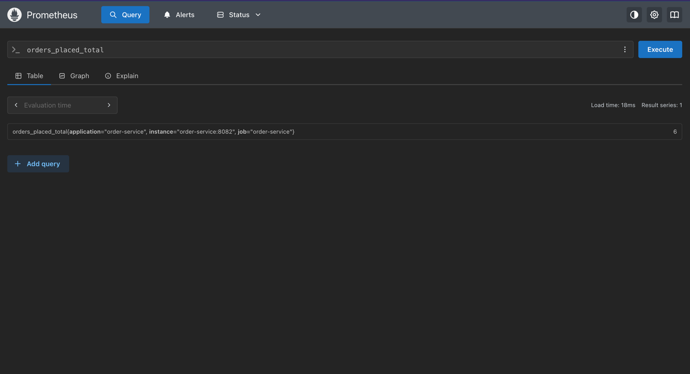

Grafana data source configuration showing the Prometheus connection at `http://prometheus:9090` set as the default data source.

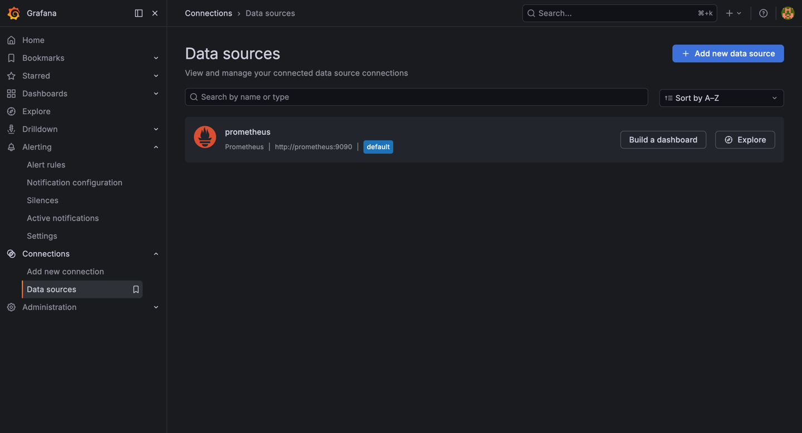

Completed Grafana dashboard with four panels populated with live data: JVM Heap Memory Usage, HTTP Request Rate, Orders Placed Total, and System CPU Usage.

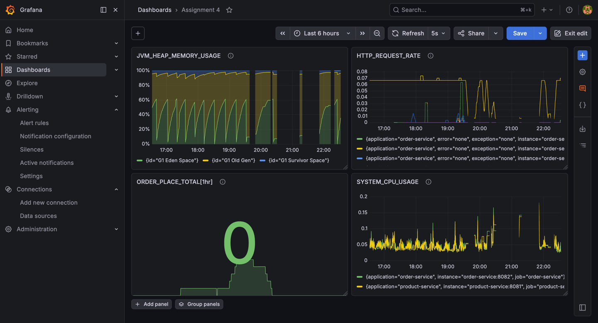

Grafana alert rule configuration for `High_Error_Rate`, showing the PromQL query that monitors HTTP 4xx/5xx error rates on the order-service.

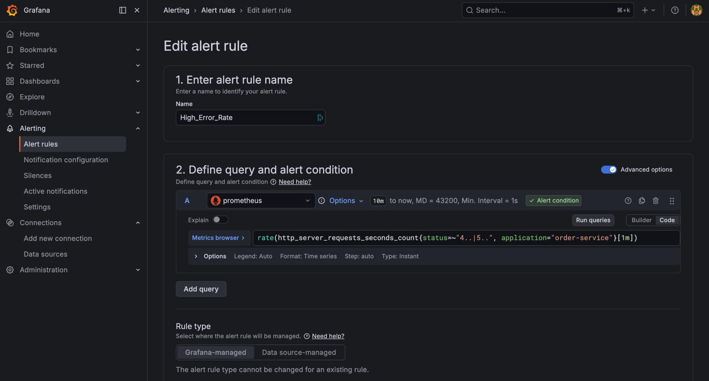

Alert rule threshold set to fire when the error rate exceeds 0.05, with folder and label configuration.

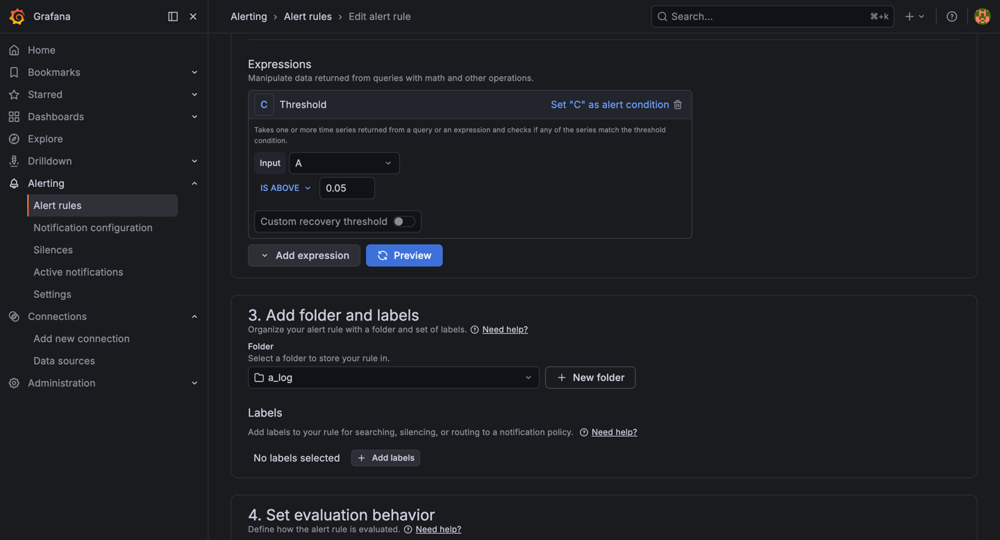

Alert evaluation interval (30s), pending period (30s), keep-firing duration (1m), and notification routing via Alertmanager to Grafana.

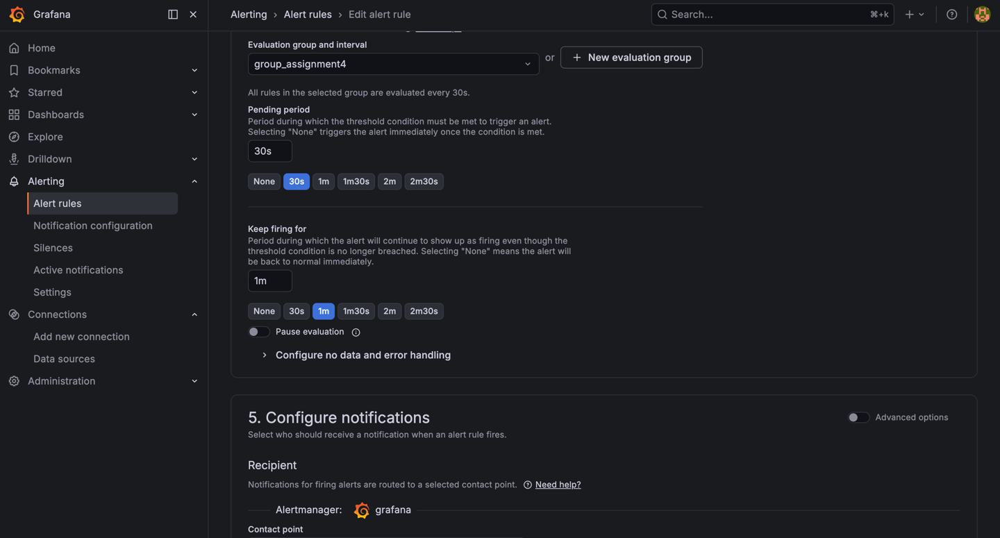

## Part 3 - Distributed Tracing with Zipkin

Zipkin UI displaying a full distributed trace with 4 spans across both services: the root `http post /api/orders` span, a custom `order-product-lookup` span, the outbound HTTP GET from order-service, and the inbound request on product-service.

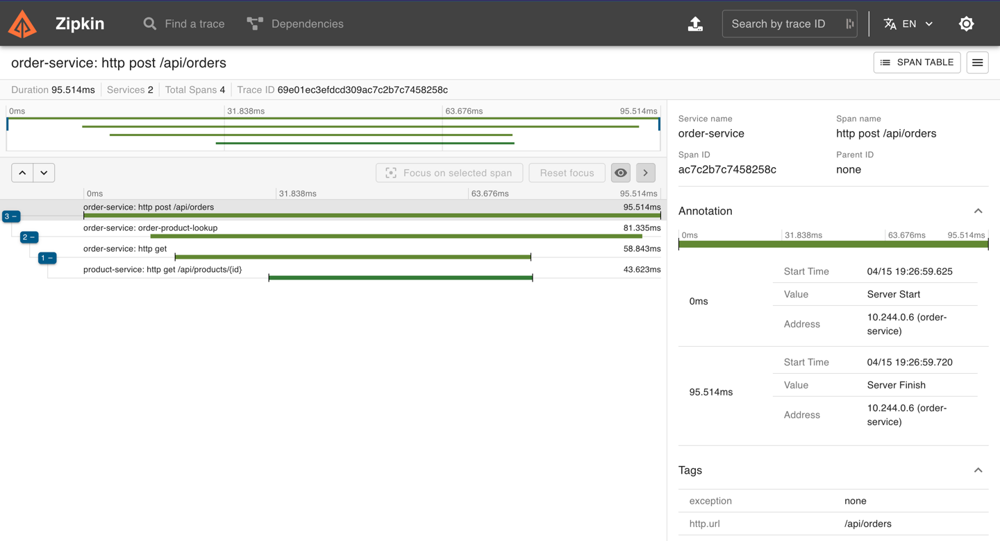

Zipkin service dependency graph showing the order-service to product-service relationship.

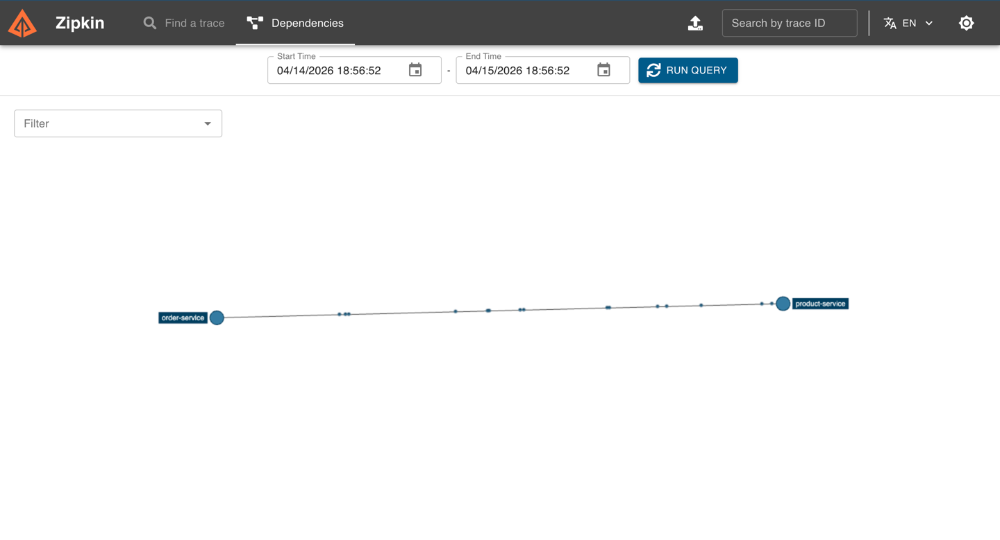

Log output showing traceId and spanId appearing alongside the correlationId in the order creation log lines, confirming tracing is connected to logging.

Log line showing both traceId and correlationId for a single order creation request with meaningful business data (productId=9999, quantity=2).

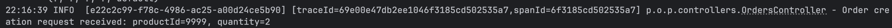

