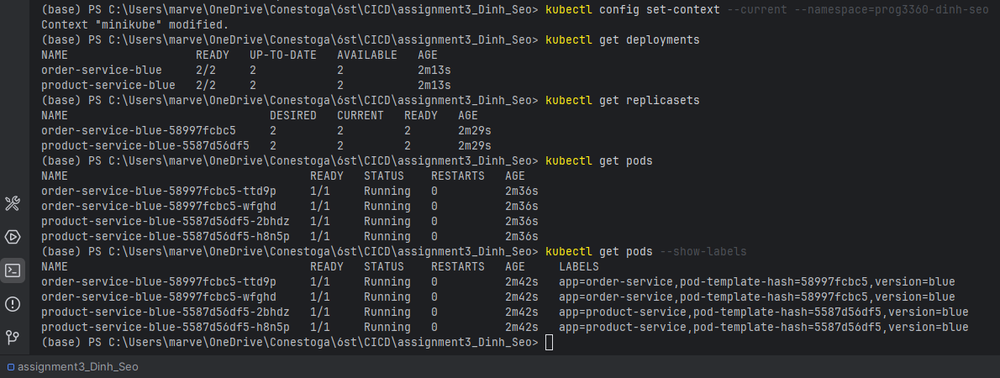
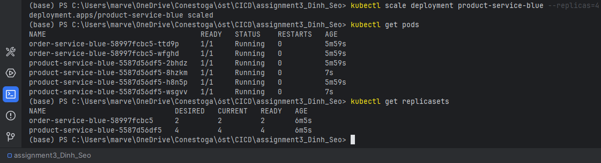
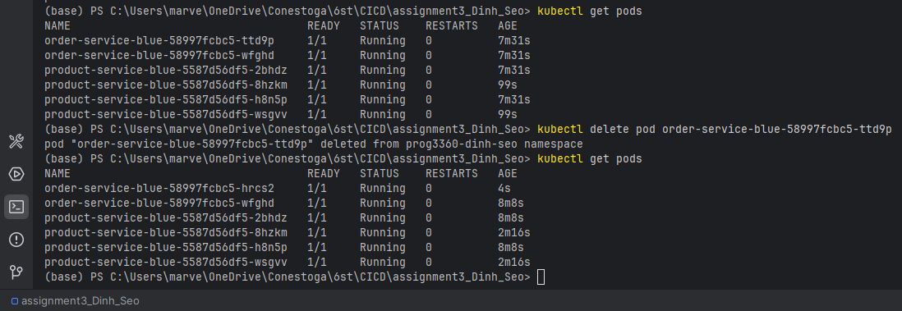
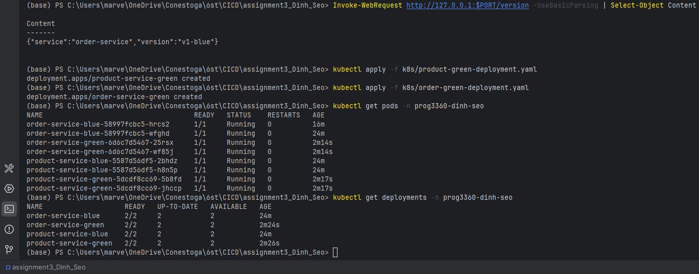
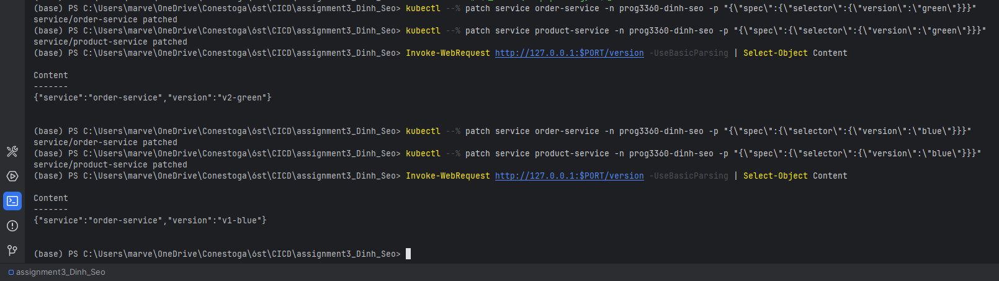

# PROG3360 Assignment 3: Kubernetes Deployment with Minikube

## Team Members

- Nathan Dinh (8765518)
- Juhwan Seo (8819123)

## Project Overview

- Service orchestration with labels and selectors
This assignment demonstrates Kubernetes deployment capabilities using Minikube, including:
- ReplicaSet management and scaling
- Self-healing capabilities
- Blue-Green Deployment strategy

<details>
<summary><strong>Quick Start</strong> (click to expand)</summary>

### Prerequisites

- Docker Desktop installed and running
- Minikube installed

### Setup and Deployment

```powershell
# 1. Start Minikube
minikube start

# 2. Connect to Minikube Docker environment (REQUIRED!)
& minikube -p minikube docker-env --shell powershell | Invoke-Expression

# 3. Set default namespace for convenience
kubectl config set-context --current --namespace=prog3360-dinh-seo

# 4. Deploy all resources
kubectl apply -f k8s/namespace.yaml
kubectl apply -f k8s/configmap.yaml
kubectl apply -f k8s/product-blue-deployment.yaml
kubectl apply -f k8s/order-blue-deployment.yaml
kubectl apply -f k8s/product-service.yaml
kubectl apply -f k8s/order-service.yaml

# 5. Verify deployment
kubectl get all
```

</details>

<details>
<summary><strong>Access Services</strong> (click to expand)</summary>

```powershell
# Get order-service URL
minikube service order-service --url

# Test API (replace PORT with actual number)
$PORT = 49777
Invoke-WebRequest http://127.0.0.1:$PORT/version -UseBasicParsing | Select-Object Content
Invoke-WebRequest http://127.0.0.1:$PORT/api/orders -UseBasicParsing | Select-Object Content
```

</details>

---

## Demonstration Evidence

### Part 2: ReplicaSet, Scaling, Self-Healing

#### Screenshot #1 - Initial Deployment Status



> Verifies all Kubernetes resources are correctly deployed and running.

- **Deployments**: 2 deployments (`product-service-blue`, `order-service-blue`), each 2/2 READY
- **ReplicaSets**: 2 RS managing pod lifecycle automatically
- **Pods**: 4 pods running across both services
- **Labels**: `app=product-service`, `version=blue` - used by Services for traffic routing

#### Screenshot #2 - Horizontal Scaling



> Demonstrates that ReplicaSet automatically manages pod count when scaling.

- **Command**: `kubectl scale deployment product-service-blue --replicas=4`
- **Result**: Pod count increased from 4 → 6 total (4 product + 2 order)
- **ReplicaSet**: DESIRED count changed from 2 → 4, confirming automatic management

#### Screenshot #3 - Self-Healing



> Proves Kubernetes automatically replaces terminated pods to maintain desired state.

- **Before**: 6 pods running (after scaling)
- **Action**: `kubectl delete pod <pod-name>` - manually killed one product pod
- **After**: New replacement pod created automatically (new name, AGE: 4s)
- **Key Point**: Desired replica count of 4 maintained without manual intervention

---

### Part 3: Blue-Green Deployment

#### Screenshot #4 - Green Deployment Setup



> Shows both blue and green versions running side-by-side with zero downtime.

- **Current version**: `/version` returns `v1-blue` (traffic still on blue)
- **Green deploy**: `kubectl apply` creates green deployments alongside blue
- **Pods**: 8 total - 4 blue + 4 green, all Running
- **Deployments**: All 4 deployments show 2/2 READY

#### Screenshot #5 - Traffic Switch & Rollback



> Demonstrates instant traffic switching and rollback via service selector patching.

- **Step 1**: `kubectl patch service` → selector changed to `version=green`
- **Step 2**: `/version` → `{"service":"order-service","version":"v2-green"}` ✅
- **Step 3**: `kubectl patch service` → selector reverted to `version=blue`
- **Step 4**: `/version` → `{"service":"order-service","version":"v1-blue"}` ✅

## Architecture

### Kubernetes Resources

| Resource | Purpose | Configuration |
|----------|---------|---------------|
| Namespace | Isolation | `prog3360-dinh-seo` |
| ConfigMap | Environment variables | `APP_VERSION`, `SERVER_PRODUCT_URL` |
| Deployments | Pod management | Blue/Green separate files |
| Services | Traffic routing | ClusterIP (product), NodePort (order) |

### Blue-Green Strategy

```
Blue Environment (Live)          Green Environment (Standby)
├── product-service-blue         ├── product-service-green
│   ├── image: v1               │   ├── image: v2
│   └── APP_VERSION: v1-blue    │   └── APP_VERSION: v2-green
└── order-service-blue           └── order-service-green
    ├── image: v1                   ├── image: v2
    └── APP_VERSION: v1-blue        └── APP_VERSION: v2-green
```